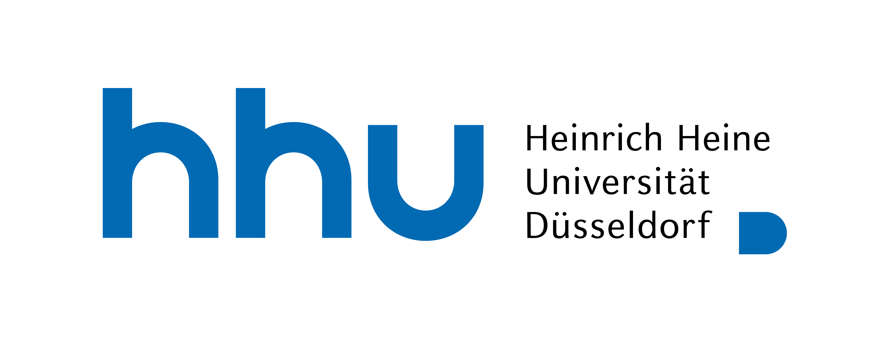

[](https://creativecommons.org/licenses/by-nc/4.0/)

# CaSpaSyn - Results from fieldwork about the syntax of Catalan and Castilian
  by 
    <a href="https://orcid.org/0000-0002-6374-1506">Niklas N. Wiskandt</a>
    ·
    <a href="https://orcid.org/0000-0002-8795-2121">Rolf Kailuweit</a>
    ·
    <a href="mailto:armin.saw@gmail.com">Armin Sawicki</a>
    ·
    <a href="mailto:sarah.m.graetz@gmail.com">Sarah M. Grätz</a>
    ·
    <a href="https://ansost.github.io">Anna S. Stein</a>
    ·
    <a href="https://de.linkedin.com/in/jessica-schamne-06334b212">Jessica Schamne</a>
    ·
    <a href="https://de.linkedin.com/in/addison-j-blanchard-rooney/de">Addison J. Blanchard-Rooney</a>

<!-- TABLE OF CONTENTS 
<details>
  <summary>Table of Contents</summary>
  <ol>
    <li>
      <a href="#about-the-project">About The Project</a>
      <a href="#getting-started">Getting Started</a>
      <ul>
        <li><a href="#prerequisites">Prerequisites</a></li>
        <li><a href="#installation">Installation</a></li>
        <li><a href="#usage">Usage</a></li>
      </ul>
    </li>
    <li><a href="#license">License</a></li>
    <li><a href="#citation">Citation</a></li>
    <li><a href="#acknowledgments">Acknowledgments</a></li>
  </ol>
</details>-->


This repository features the code and data of the projects with a quantitative analysis. The `acceptability study` presents results on acceptability ratings of pronominal and active constructions for psych verbs in Catalan and Spanish. The `scetch study` presents results from prompt written elicitation of psych verbs in Catalan and Spanish. An abstract, slides and more information can be found in the README of the respective folders.
Each of the folders contains a `code` and a `data` folder containing the respective files for the project. 
> There is a HTML file of the analysis to facilitate reading. 

## Getting the code and data
To get the whole data and code, clone the repository using [git](https://git-scm.com/)
```sh
git@github.com:ansost/CaSpaSyn.git
```
or [download it as a zip archive](https://github.com/ansost/CaSpaSyn/archive/refs/heads/main.zip).
You can also download the individual files and folders directly. 

You need to have [R](https://cran.r-project.org/) and [RStudio](https://posit.co/download/rstudio-desktop/) installed in order to reproduce this analysis. 

<!--## Citation
- Name, Name. Year. A cool title. In Proceedings of something, pagesx-x, place, country. Publisher.

```bibtex
@inproceedings{authors-etal-year-stichwort,
    title = "CaSpaSyn",
    author = "name1, name2",
    booktitle = "booktitle",
    month = month,
    year = "year",
    address = "place, country",
    publisher = "publisher",
    url = "url",
    doi = "doi",
    pages = "pages",
}
```
-->

# About the project
In May 2023 a group of students from the Romance and the Linguistics department had the opportunity to conduct field work Mallorca concerning psych-predicates in Romance Languages (Focus on Spanish and Catalan). The trip was funded by DAAD Hochschuldialog mit Südeuropa 2023 and is a cooperation between the Heinrich Heine University Düsseldorf and the University of the Balearic Islands. Across all sub-projects the students conducted filedwork concerning several research questions: 
- To which extent do we find variation in Balear Catalan?
  - Do Balear Catalan differ from Standard Catalan?
  - Is there an influence of Spanish on Balear Catalan?
  - What is the role of attitudes concerning the Catalan of Barcelona?
- Polycentric Variation of Spanish?
  - Are the islands a centre of Spanish that differs from Standard European Spanish?
  - Differences according to the origin of the informant (Peninsular, LA, Local)?
- How to deal with intrasystematic variation?
  - What are the factors (Causativity, Stativity, etc.)?
  - Theoretical considerations, formal descriptions?

## Acknowledgments
We are very grateful to **Elga Cremades** and her team for their continued support and organisation of the fieldwork on Mallorca.

### DAAD Hochschudialog Südeuropa


We are also grateful to have received funding from the **German Academic Exchange Service (DAAD)** from the <a href="https://www.w3schools.com](https://www2.daad.de/hochschulen/ausschreibungen/projekte/de/11342-foerderprogramme-finden/?s=1&projektid=57634887">Hochschuldialog Südeuropa fund</a> and from QVM Mittel from the **Philosophical Faculty of the Heinrich Heine University**.

# License
Distributed under the MIT License. See [LICENSE.txt](https://github.com/ansost/CaSpaSyn/blob/main/LICENSE) for more information.
